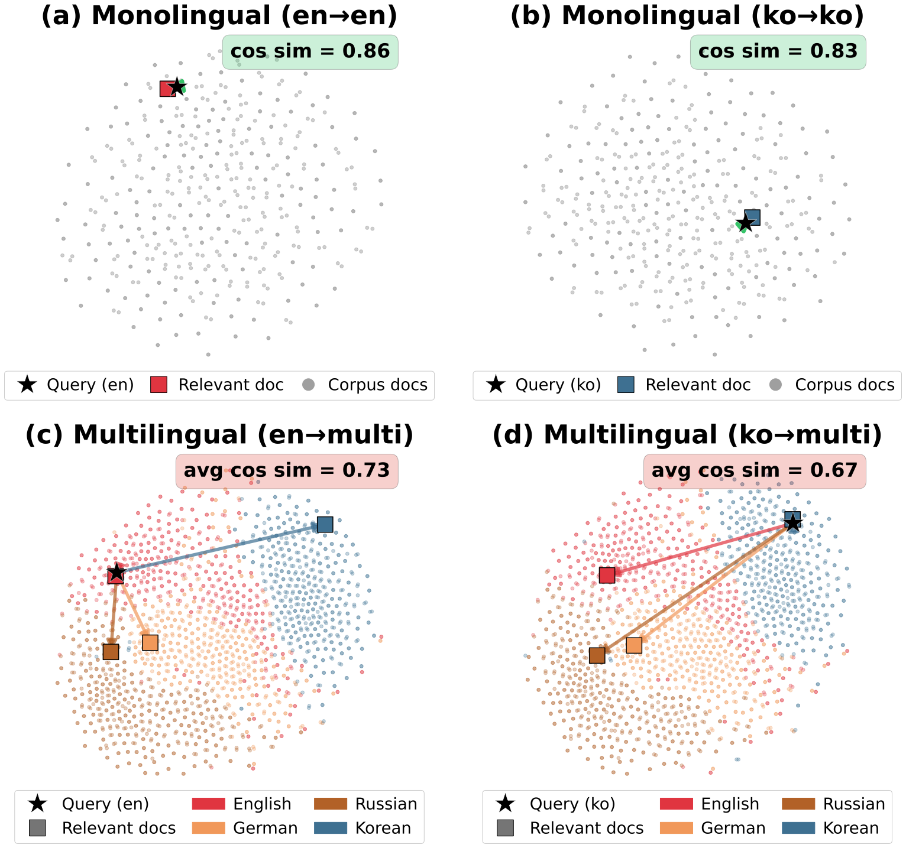

<div align="center">

# MIMO

### MIMO: Multilingual Information Retrieval via Monolingual Objectives

[](https://2026.emnlp.org/)
[](https://arxiv.org/abs/2605.31171)
[](LICENSE)
[](https://www.python.org/)
[](https://huggingface.co/yjoonjang/MIMO-xlm-roberta-large)
[](https://huggingface.co/datasets/yjoonjang/mlir-benchmarks)



<b>Official implementation of the <a href="https://2026.emnlp.org/">EMNLP 2026</a> (Main Conference) paper.</b>

</div>

---

## News

- **2026-08** · Accepted to **EMNLP 2026** (Main Conference). Code, [models](https://huggingface.co/yjoonjang/MIMO-xlm-roberta-large), and [MLIR benchmarks](https://huggingface.co/datasets/yjoonjang/mlir-benchmarks) are public.
- **2026-05** · Paper released on [arXiv](https://arxiv.org/abs/2605.31171).

## Overview

MIMO is a two-stage training framework for Multilingual Information Retrieval (MLIR) that anchors a multilingual student model to the stable English semantic space of a high-performing teacher (Qwen3-Embedding-8B):

- **Stage 1 — Cross-lingual Distillation Warmup**: the student learns to map multilingual inputs into the teacher's English embedding space via a linear projection and cosine-distance distillation on parallel sentences.
- **Stage 2 — Joint Optimization**: cross-lingual contrastive learning (XLCO) and knowledge distillation are jointly optimized on mMARCO parallel data:

```
L = λ · L_XLCO + (1 − λ) · L_Distill      (λ = 0.2)
```

The projection layer is used only during training — at inference, the student's native embeddings are used directly.

## Installation

Requires Python ≥ 3.10 and [uv](https://docs.astral.sh/uv/).

```bash
git clone https://github.com/yjoonjang/MIMO.git
cd MIMO
uv sync

# Optional: FlashAttention-2 for the teacher (otherwise pass --teacher_attn_implementation sdpa)
uv sync --extra flash
```

## Data preparation

All datasets are downloaded from their original public sources and materialized under `data/`:

```bash
# Stage 1: OPUS parallel sentences (8 corpora, 14 languages, ~5.6M pairs)
uv run python scripts/prepare_data/prepare_stage1_parallel.py --output_dir data/stage1_parallel

# Stage 2: aligned mMARCO parallel table (532k rows x 14 languages) ...
uv run python scripts/prepare_data/build_mmarco_parallel.py --output_dir data/mmarco_parallel

# ... then pre-sample per-loss-type training sets with uniform language distribution
uv run python scripts/prepare_data/prepare_stage2_datasets.py \
    --source data/mmarco_parallel --output_dir data/stage2 --seed 42

# (optional) rebuild the MLIR evaluation benchmarks from the original sources —
# evaluation downloads the released ones from the HF Hub automatically
uv run python scripts/prepare_data/build_benchmarks.py \
    --output_dir data/benchmarks --multilingual_queries
```

## Training

Hyperparameters in the scripts match the paper (Appendix C, Table 6). Experiments were run on 2× H100 GPUs; gradient caching keeps the global batch size of 2048 within memory.

```bash
# Stage 1: distillation warmup (xlm-roberta-large or jhu-clsp/mmBERT-base; mean or cls pooling)
bash scripts/train_stage1.sh FacebookAI/xlm-roberta-large mean

# Stage 2: joint optimization (λ = 0.2)
bash scripts/train_stage2.sh outputs/stage1/stage1-qwen3-xlm-roberta-large-mean 0.2

# Baselines: identical data/backbones/schedule, teacher-free losses
bash scripts/train_baseline.sh FacebookAI/xlm-roberta-large mean infonce
bash scripts/train_baseline.sh FacebookAI/xlm-roberta-large mean cross_infonce   # XLCO
bash scripts/train_baseline.sh FacebookAI/xlm-roberta-large mean lakda
```

## Evaluation

```bash
# Everything reported in the paper for one model:
bash scripts/evaluate_all.sh /path/to/model

# Individually:
uv run python evaluate.py --model_name_or_path /path/to/model            # MLIR: Belebele, MLQA, XQuAD, MultiEuP-v2 (+ MRC/PEER fairness)
uv run python evaluate_neuclir.py --model_name_or_path /path/to/model    # NeuCLIR'22/'23 (English query × mixed ru∪zh corpus)
uv run python evaluate_miracl.py --model_name_or_path /path/to/model     # MIRACL (multi-monolingual, via MTEB)
```

The MLIR benchmarks pool all language versions of the context passages into one corpus; every language version of the gold context is a positive. `evaluate.py` downloads the exact benchmark files used in the paper from [yjoonjang/mlir-benchmarks](https://huggingface.co/datasets/yjoonjang/mlir-benchmarks) automatically (a local `data/benchmarks` or `--data_dir` takes precedence; `scripts/prepare_data/build_benchmarks.py` rebuilds them from the original sources).

## Inference

The released models are standard `sentence-transformers` checkpoints:

```python
from sentence_transformers import SentenceTransformer

model = SentenceTransformer("yjoonjang/MIMO-xlm-roberta-large")

q_emb = model.encode(["multilingual search query"], normalize_embeddings=True)
d_emb = model.encode(["relevant document in any language"], normalize_embeddings=True)
scores = q_emb @ d_emb.T
```

## Released artifacts

| Artifact | Link |
|---|---|
| MIMO (xlm-roberta-large) | [yjoonjang/MIMO-xlm-roberta-large](https://huggingface.co/yjoonjang/MIMO-xlm-roberta-large) |
| MIMO (mmBERT-base) | [yjoonjang/MIMO-mmBERT-base](https://huggingface.co/yjoonjang/MIMO-mmBERT-base) |
| MLIR evaluation benchmarks | [yjoonjang/mlir-benchmarks](https://huggingface.co/datasets/yjoonjang/mlir-benchmarks) |

## Project structure

```
├── train.py                  # Stage 1/2 + baseline training entry (HfArgumentParser)
├── evaluate.py               # MLIR benchmarks + MRC/PEER fairness metrics
├── evaluate_neuclir.py       # NeuCLIR'22/'23 mixed-corpus MLIR
├── evaluate_miracl.py        # MIRACL via MTEB
├── src/mimo/
│   ├── losses/               # embed_distill (Stage 1), cached {distill_infonce, infonce, lakda} (Stage 2)
│   ├── data/                 # dual-tokenizer collator, dataset loading
│   ├── trainer/              # MIMOTrainer (projection saving, DDP static graph)
│   └── evaluation/           # benchmark loading, MRC/PEER, NanoMIRACL mid-training eval
├── scripts/
│   ├── prepare_data/         # Stage 1 (OPUS), Stage 2 (mMARCO), and benchmark pipelines
│   └── train_*.sh, evaluate_all.sh
└── tests/
```

## Citation

```bibtex
@inproceedings{jang2026mimo,
  title     = {{MIMO}: Multilingual Information Retrieval via Monolingual Objectives},
  author    = {Jang, Youngjoon and Hong, Seongtae and Lim, Heuiseok},
  booktitle = {Proceedings of the 2026 Conference on Empirical Methods in Natural Language Processing},
  year      = {2026},
  url       = {https://arxiv.org/abs/2605.31171}
}
```

## License

[MIT](LICENSE)
